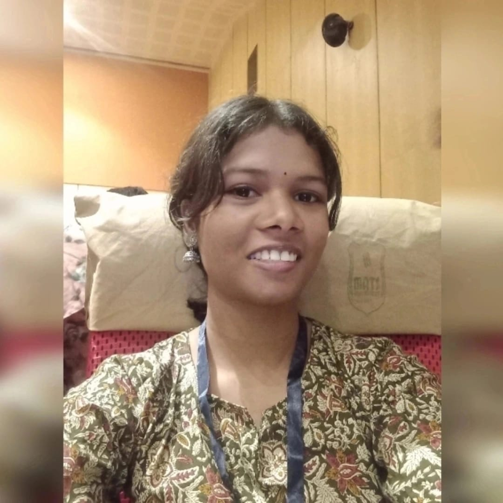

# 30-days-of-code-tcp-2026

**Name-Sagarika Sahoo**

**Roll No.-25115093**

**Branch-CSE**

<!DOCTYPE html>
<html lang="en">
<head>
    <meta charset="UTF-8">
    <title>Personal Portfolio</title>
</head>
<body>

    <header>
     <h1>Sagarika Sahoo</h1>
    </header>

    <main>
        <section>
            <h2><b><u>Bio:</u></b></h2>
            
            
Hey! everyone, I'm Sagarika Sahoo, CSE undergraduate, passionate about software development & machine learning[ML]. Curretly, I'm focused on strengthening my DSA skills & working on my problem solving skills & working on real-world ML projects.

        </section>

        <section>
            <h2><b><u>My Skills:</u></b></h2>
            <h3>Soft Skills:</h3>
            <ul>
                <li>Problem solving</li>
                <li>Project Management</li>
                <li>Communication Skills</li>
                <li>Time Management</li>
            </ul>
            <h3>Hard Skills:</h3>
            <ul>
                <li>Programming in Python, C++</li>
                <li>Data Structure & Algorithms</li>
                <li>Machine Learning and Deep Learning{Basics}</li>
            </ul>
        </section>

        <section>
            <h2><u>Project Showcase</u></h2>
            <article>
                <h2><b>CycleGan</b></h2>
                <h3>Project 1: DCGan Project-CIFAR-10:<h3>
                    
Developed a Deep Convolutional GAN(DCGan) to generate realistic images using CIFAR-10 dataset.Implemented and trained the model in a Google Colab Notebook.

                    <h4>Technical Skills Used:</h4><small>Python, PyTorch, Deep Learning & GANs.</small>
            </article>
            <article>
                <h3>Project 2: Pix2Pix-Image-to-Image Translation:</h3>
                
Implemented a Pix2Pix conditional GAN for image-to-image translation using the Cityscapes dataset sourced from Kaggle.

                    <h4>Technical Skills Used:</h4><small>Python,CNNs & U-Net, PyTorch, Deep Learning & Conditional GANs(Pix2Pix).</small>
                     
            </article>
        </section>

        <section>
<h2>Resources</h2>

<iframe
  width="560"
  height="315"
  src="https://www.youtube.com/embed/HcOc7P5BMi4"
  title="YouTube video player"
  frameborder="0"
  allow="accelerometer; autoplay; clipboard-write; encrypted-media; gyroscope; picture-in-picture"
  allowfullscreen>
</iframe>
        </section>

        <section>
            <h2>Testimonial</h2>
            <blockquote cite="https://chatgpt.com/">
                ""Development taught me that bugs are just features waiting for documentation—and every error is one step closer to clean code. Keep building, keep breaking, and keep learning.""
                 
                <cite>— Sagarika Sahoo</cite>
            </blockquote>
        </section>
    </main>

    <footer>
        <nav>
            <ul>
                <li><a href="about.html">About Me</a></li>
            </ul>
        </nav>
    </footer>

</body>
</html>
